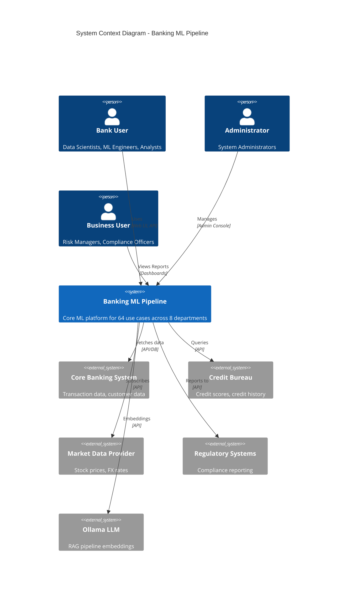
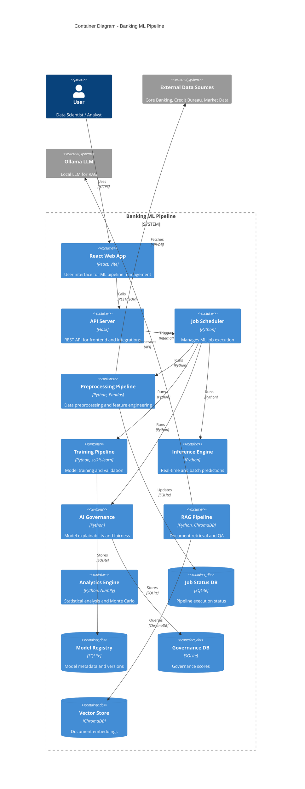
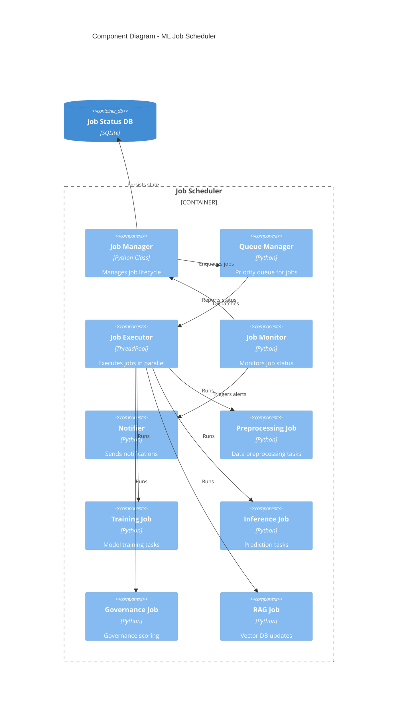
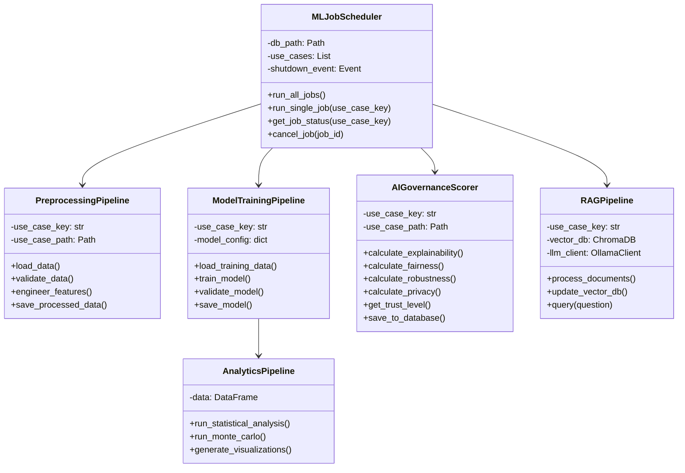
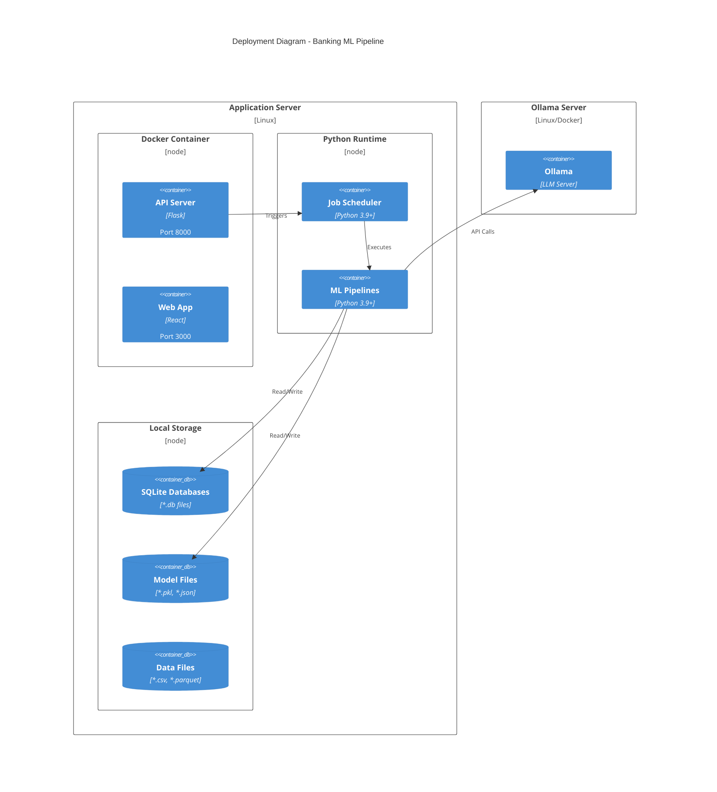

# C4 Model - Banking ML Pipeline

## Level 1: System Context Diagram

```mermaid
C4Context
    title System Context Diagram - Banking ML Pipeline

    Person(user, "Bank User", "Data Scientists, ML Engineers, Analysts")
    Person(admin, "Administrator", "System Administrators")
    Person(business, "Business User", "Risk Managers, Compliance Officers")

    System(mlpipeline, "Banking ML Pipeline", "Core ML platform for 64 use cases across 8 departments")

    System_Ext(corebanking, "Core Banking System", "Transaction data, customer data")
    System_Ext(creditbureau, "Credit Bureau", "Credit scores, credit history")
    System_Ext(marketdata, "Market Data Provider", "Stock prices, FX rates")
    System_Ext(compliance, "Regulatory Systems", "Compliance reporting")
    System_Ext(ollama, "Ollama LLM", "RAG pipeline embeddings")

    Rel(user, mlpipeline, "Uses", "Web UI, API")
    Rel(admin, mlpipeline, "Manages", "Admin Console")
    Rel(business, mlpipeline, "Views Reports", "Dashboards")

    Rel(mlpipeline, corebanking, "Fetches data", "API/DB")
    Rel(mlpipeline, creditbureau, "Queries", "API")
    Rel(mlpipeline, marketdata, "Subscribes", "API")
    Rel(mlpipeline, compliance, "Reports to", "API")
    Rel(mlpipeline, ollama, "Embeddings", "API")
```

## Level 2: Container Diagram

```mermaid
C4Container
    title Container Diagram - Banking ML Pipeline

    Person(user, "User", "Data Scientist / Analyst")

    System_Boundary(mlsystem, "Banking ML Pipeline") {
        Container(webapp, "React Web App", "React, Vite", "User interface for ML pipeline management")
        Container(api, "API Server", "Flask", "REST API for frontend and integrations")
        Container(scheduler, "Job Scheduler", "Python", "Manages ML job execution")
        Container(preprocessing, "Preprocessing Pipeline", "Python, Pandas", "Data preprocessing and feature engineering")
        Container(training, "Training Pipeline", "Python, scikit-learn", "Model training and validation")
        Container(inference, "Inference Engine", "Python", "Real-time and batch predictions")
        Container(governance, "AI Governance", "Python", "Model explainability and fairness")
        Container(rag, "RAG Pipeline", "Python, ChromaDB", "Document retrieval and QA")
        Container(analytics, "Analytics Engine", "Python, NumPy", "Statistical analysis and Monte Carlo")

        ContainerDb(jobdb, "Job Status DB", "SQLite", "Pipeline execution status")
        ContainerDb(modeldb, "Model Registry", "SQLite", "Model metadata and versions")
        ContainerDb(governancedb, "Governance DB", "SQLite", "Governance scores")
        ContainerDb(vectordb, "Vector Store", "ChromaDB", "Document embeddings")
    }

    System_Ext(datasources, "External Data Sources", "Core Banking, Credit Bureau, Market Data")
    System_Ext(llm, "Ollama LLM", "Local LLM for RAG")

    Rel(user, webapp, "Uses", "HTTPS")
    Rel(webapp, api, "Calls", "REST/JSON")
    Rel(api, scheduler, "Triggers", "Internal")
    Rel(scheduler, preprocessing, "Runs", "Python")
    Rel(scheduler, training, "Runs", "Python")
    Rel(scheduler, inference, "Runs", "Python")
    Rel(scheduler, governance, "Runs", "Python")
    Rel(preprocessing, jobdb, "Updates", "SQLite")
    Rel(training, modeldb, "Stores", "SQLite")
    Rel(governance, governancedb, "Stores", "SQLite")
    Rel(rag, vectordb, "Queries", "ChromaDB")
    Rel(rag, llm, "Generates", "API")
    Rel(preprocessing, datasources, "Fetches", "API/DB")
```

## Level 3: Component Diagram

```mermaid
C4Component
    title Component Diagram - ML Job Scheduler

    Container_Boundary(scheduler, "Job Scheduler") {
        Component(jobmanager, "Job Manager", "Python Class", "Manages job lifecycle")
        Component(queuemanager, "Queue Manager", "Python", "Priority queue for jobs")
        Component(executor, "Job Executor", "ThreadPool", "Executes jobs in parallel")
        Component(monitor, "Job Monitor", "Python", "Monitors job status")
        Component(notifier, "Notifier", "Python", "Sends notifications")

        Component(preproc_job, "Preprocessing Job", "Python", "Data preprocessing tasks")
        Component(train_job, "Training Job", "Python", "Model training tasks")
        Component(infer_job, "Inference Job", "Python", "Prediction tasks")
        Component(gov_job, "Governance Job", "Python", "Governance scoring")
        Component(rag_job, "RAG Job", "Python", "Vector DB updates")
    }

    ContainerDb(jobdb, "Job Status DB", "SQLite")

    Rel(jobmanager, queuemanager, "Enqueues jobs")
    Rel(queuemanager, executor, "Dispatches")
    Rel(executor, preproc_job, "Runs")
    Rel(executor, train_job, "Runs")
    Rel(executor, infer_job, "Runs")
    Rel(executor, gov_job, "Runs")
    Rel(executor, rag_job, "Runs")
    Rel(monitor, jobmanager, "Reports status")
    Rel(monitor, notifier, "Triggers alerts")
    Rel(jobmanager, jobdb, "Persists state")
```

## Level 4: Code Diagram

```mermaid
classDiagram
    class MLJobScheduler {
        -db_path: Path
        -use_cases: List
        -shutdown_event: Event
        +run_all_jobs()
        +run_single_job(use_case_key)
        +get_job_status(use_case_key)
        +cancel_job(job_id)
    }

    class PreprocessingPipeline {
        -use_case_key: str
        -use_case_path: Path
        +load_data()
        +validate_data()
        +engineer_features()
        +save_processed_data()
    }

    class ModelTrainingPipeline {
        -use_case_key: str
        -model_config: dict
        +load_training_data()
        +train_model()
        +validate_model()
        +save_model()
    }

    class AIGovernanceScorer {
        -use_case_key: str
        -use_case_path: Path
        +calculate_explainability()
        +calculate_fairness()
        +calculate_robustness()
        +calculate_privacy()
        +get_trust_level()
        +save_to_database()
    }

    class RAGPipeline {
        -use_case_key: str
        -vector_db: ChromaDB
        -llm_client: OllamaClient
        +process_documents()
        +update_vector_db()
        +query(question)
    }

    class AnalyticsPipeline {
        -data: DataFrame
        +run_statistical_analysis()
        +run_monte_carlo()
        +generate_visualizations()
    }

    MLJobScheduler --> PreprocessingPipeline
    MLJobScheduler --> ModelTrainingPipeline
    MLJobScheduler --> AIGovernanceScorer
    MLJobScheduler --> RAGPipeline
    ModelTrainingPipeline --> AnalyticsPipeline
```

## Deployment Diagram

```mermaid
C4Deployment
    title Deployment Diagram - Banking ML Pipeline

    Deployment_Node(server, "Application Server", "Linux") {
        Deployment_Node(docker, "Docker Container") {
            Container(api, "API Server", "Flask", "Port 8000")
            Container(webapp, "Web App", "React", "Port 3000")
        }

        Deployment_Node(python, "Python Runtime") {
            Container(scheduler, "Job Scheduler", "Python 3.9+")
            Container(pipelines, "ML Pipelines", "Python 3.9+")
        }

        Deployment_Node(storage, "Local Storage") {
            ContainerDb(sqlite, "SQLite Databases", "*.db files")
            ContainerDb(models, "Model Files", "*.pkl, *.json")
            ContainerDb(data, "Data Files", "*.csv, *.parquet")
        }
    }

    Deployment_Node(ollama_server, "Ollama Server", "Linux/Docker") {
        Container(ollama, "Ollama", "LLM Server")
    }

    Rel(api, scheduler, "Triggers")
    Rel(scheduler, pipelines, "Executes")
    Rel(pipelines, sqlite, "Read/Write")
    Rel(pipelines, models, "Read/Write")
    Rel(pipelines, ollama, "API Calls")
```
