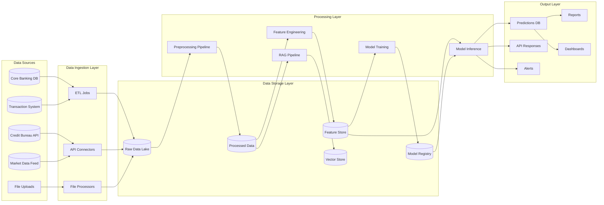
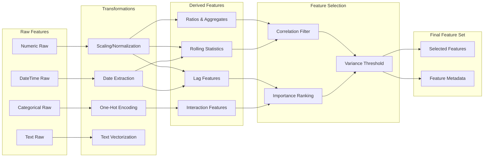
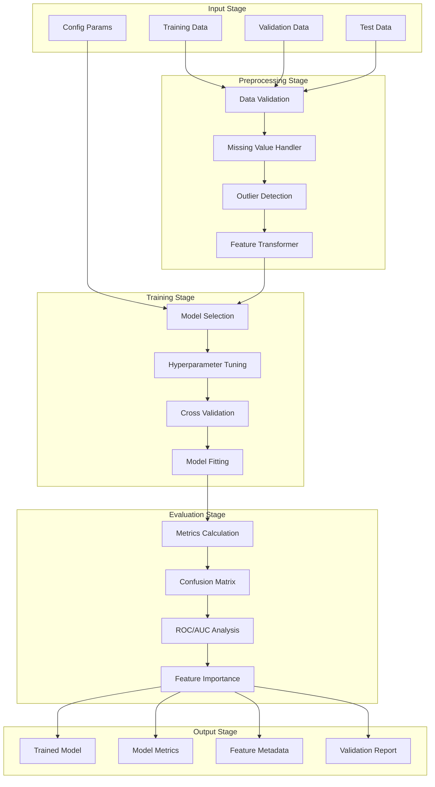
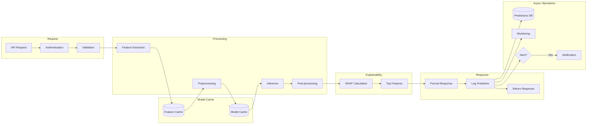
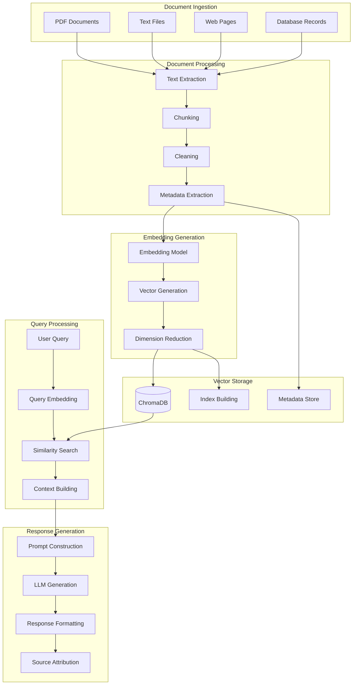
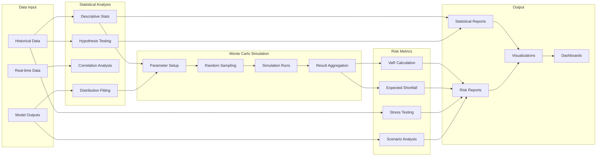

# Data Flow Diagrams - Banking ML Pipeline

## 1. Overall Data Flow

## 2. Department-wise Data Flow

```mermaid
flowchart TB
    subgraph Central["Central Data Hub"]
        CDH[(Enterprise Data Lake)]
    end

    subgraph Risk["Risk Management"]
        R1[Credit Risk Data]
        R2[Market Risk Data]
        R3[Operational Risk Data]
        RM[Risk Models]
        R1 --> RM
        R2 --> RM
        R3 --> RM
    end

    subgraph Credit["Credit Analysis"]
        C1[Loan Application Data]
        C2[Payment History]
        C3[Credit Bureau Data]
        CM[Credit Models]
        C1 --> CM
        C2 --> CM
        C3 --> CM
    end

    subgraph Fraud["Fraud Detection"]
        F1[Transaction Data]
        F2[Device Data]
        F3[Behavioral Data]
        FM[Fraud Models]
        F1 --> FM
        F2 --> FM
        F3 --> FM
    end

    subgraph Customer["Customer Analytics"]
        CU1[Customer Profile]
        CU2[Interaction Data]
        CU3[Product Holdings]
        CUM[Customer Models]
        CU1 --> CUM
        CU2 --> CUM
        CU3 --> CUM
    end

    subgraph Compliance["Compliance"]
        CO1[KYC Data]
        CO2[Transaction Records]
        CO3[Sanctions Lists]
        COM[Compliance Models]
        CO1 --> COM
        CO2 --> COM
        CO3 --> COM
    end

    CDH --> R1
    CDH --> R2
    CDH --> R3
    CDH --> C1
    CDH --> C2
    CDH --> F1
    CDH --> F2
    CDH --> CU1
    CDH --> CU2
    CDH --> CO1
    CDH --> CO2

    RM --> CDH
    CM --> CDH
    FM --> CDH
    CUM --> CDH
    COM --> CDH
```

## 3. Feature Engineering Data Flow

## 4. Model Pipeline Data Flow

## 5. Real-time Inference Data Flow

## 6. RAG Pipeline Data Flow

## 7. Analytics Data Flow

