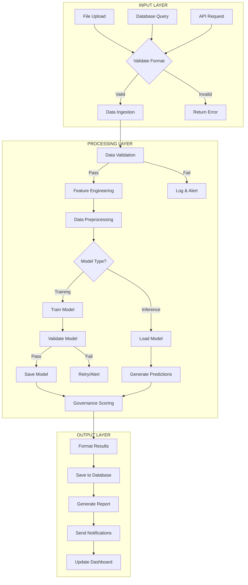
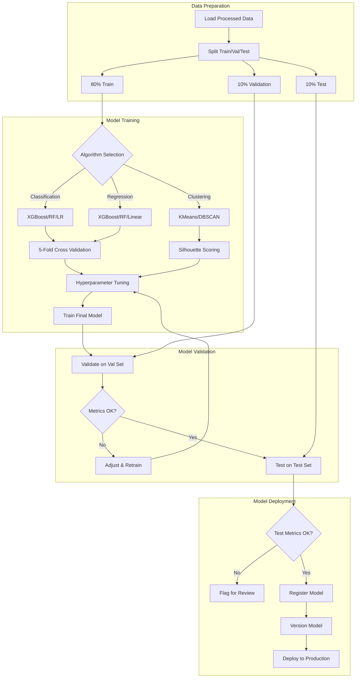
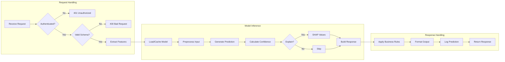
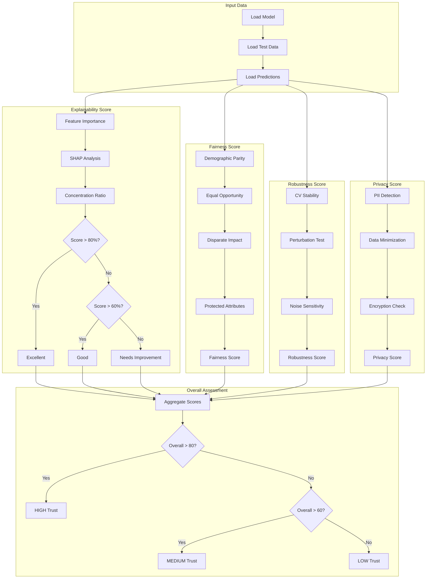
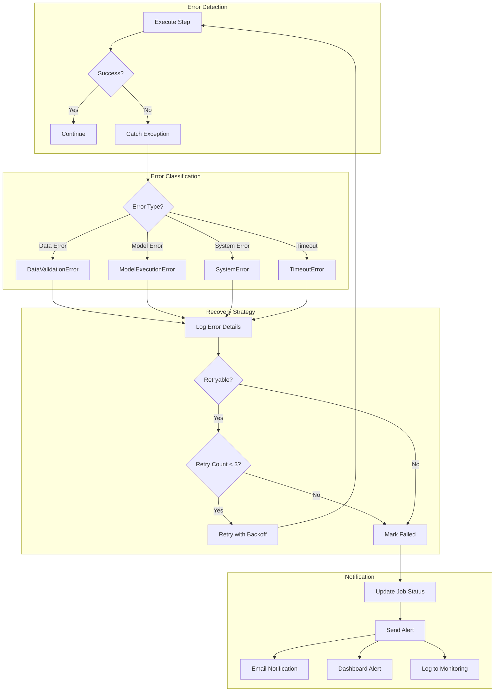
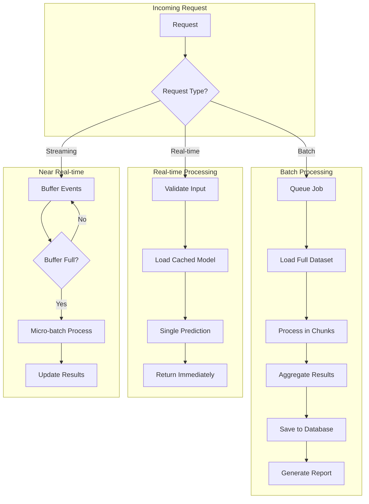

# Flowcharts - Banking ML Pipeline

## 1. Main Pipeline Flow

## 2. Data Preprocessing Flow

```mermaid
flowchart LR
    subgraph Load["Data Loading"]
        L1[Read Source] --> L2{Source Type?}
        L2 -->|CSV| L3[pd.read_csv]
        L2 -->|JSON| L4[pd.read_json]
        L2 -->|DB| L5[SQL Query]
        L2 -->|API| L6[API Fetch]
        L3 --> L7[Raw DataFrame]
        L4 --> L7
        L5 --> L7
        L6 --> L7
    end

    subgraph Validate["Data Validation"]
        L7 --> V1{Schema Valid?}
        V1 -->|No| V2[Schema Error]
        V1 -->|Yes| V3{Missing > 5%?}
        V3 -->|Yes| V4[Quality Warning]
        V3 -->|No| V5[Continue]
        V4 --> V5
    end

    subgraph Clean["Data Cleaning"]
        V5 --> C1[Remove Duplicates]
        C1 --> C2[Handle Outliers]
        C2 --> C3{Missing Values}
        C3 -->|Numeric| C4[Impute Mean/Median]
        C3 -->|Categorical| C5[Impute Mode]
        C3 -->|Drop| C6[Remove Rows]
        C4 --> C7[Clean DataFrame]
        C5 --> C7
        C6 --> C7
    end

    subgraph Transform["Feature Engineering"]
        C7 --> T1[Encode Categoricals]
        T1 --> T2[Scale Numerics]
        T2 --> T3[Create Derived Features]
        T3 --> T4[Feature Selection]
        T4 --> T5[Final Features]
    end
```

## 3. Model Training Flow

## 4. Inference Flow

## 5. Governance Scoring Flow

## 6. Error Handling Flow

## 7. Batch vs Real-time Processing

