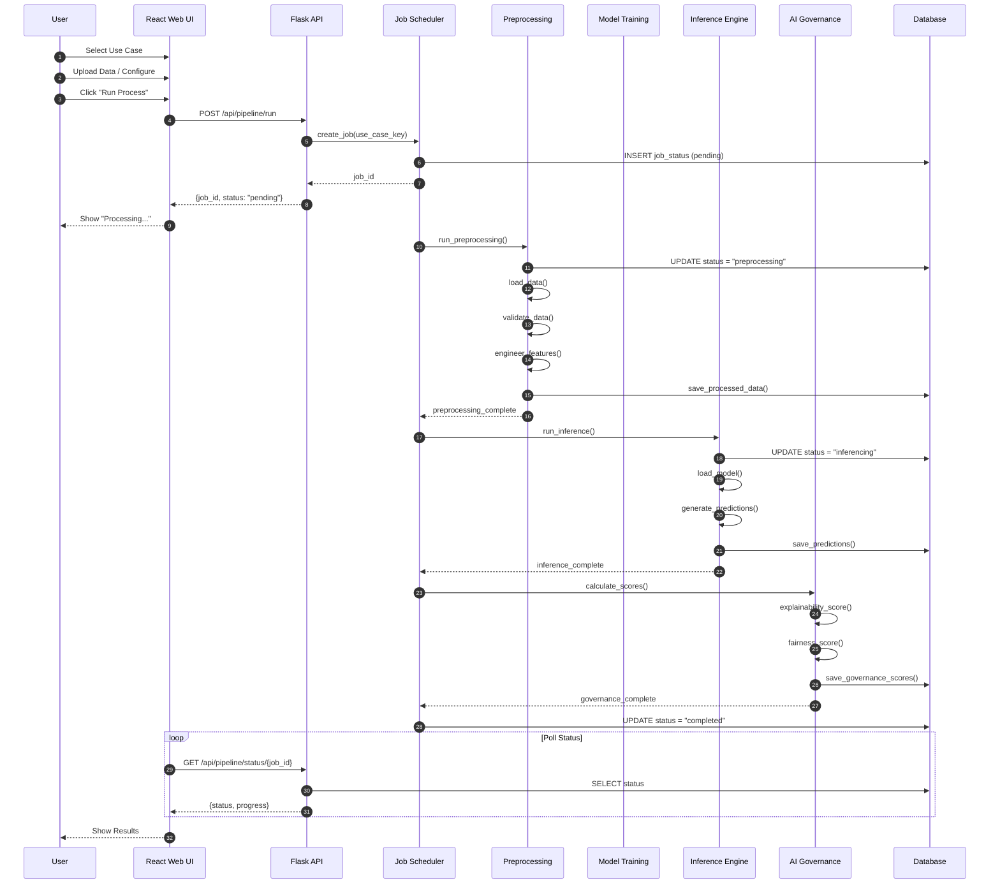
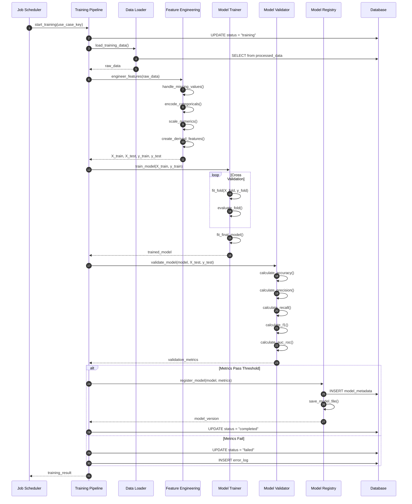
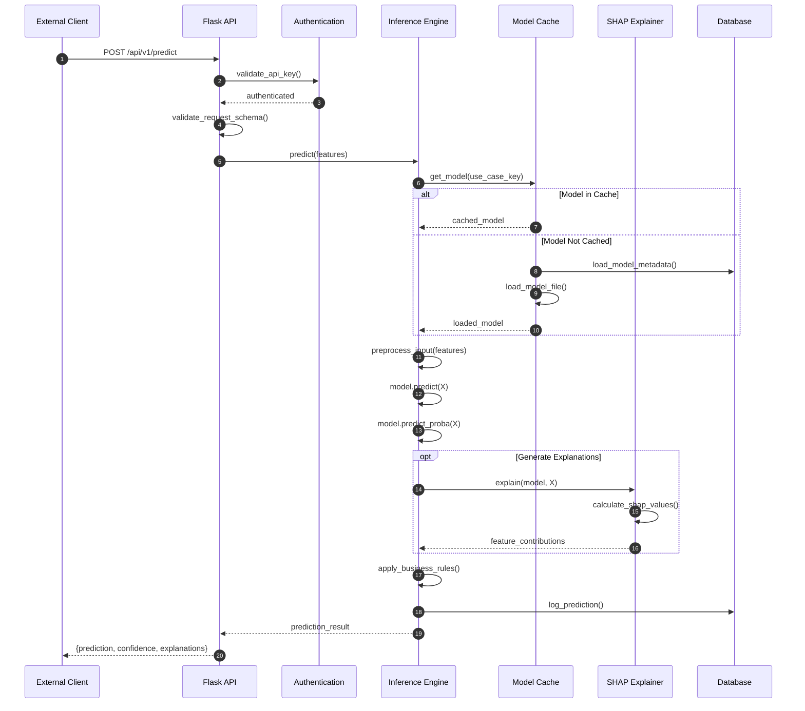
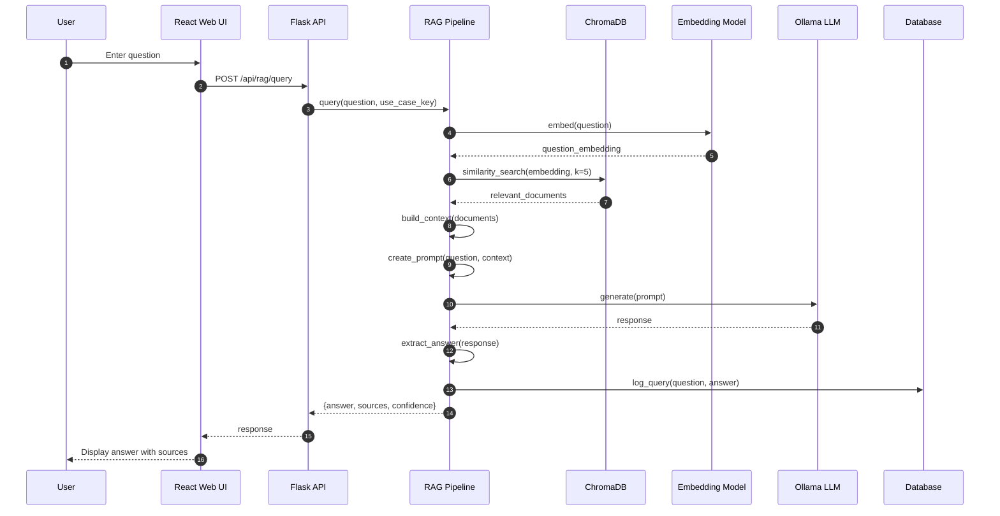
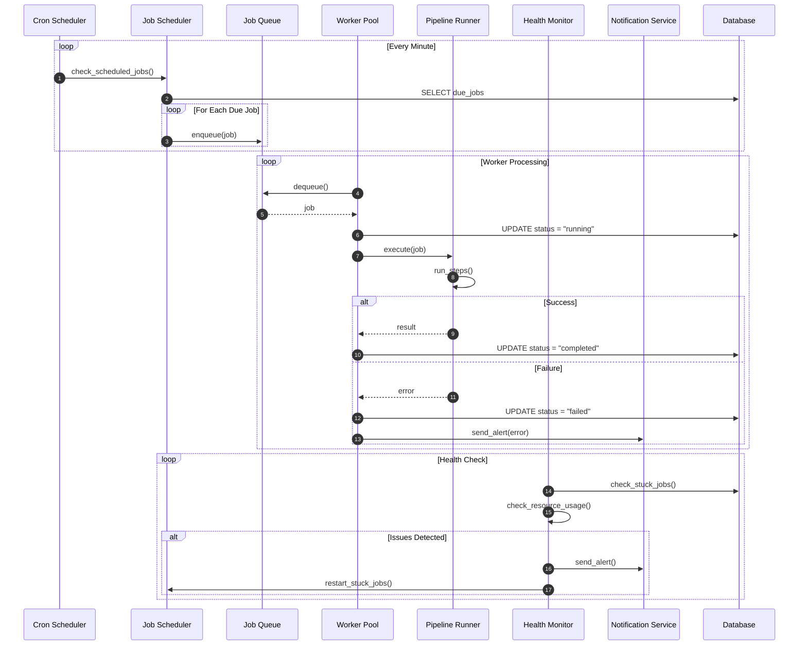
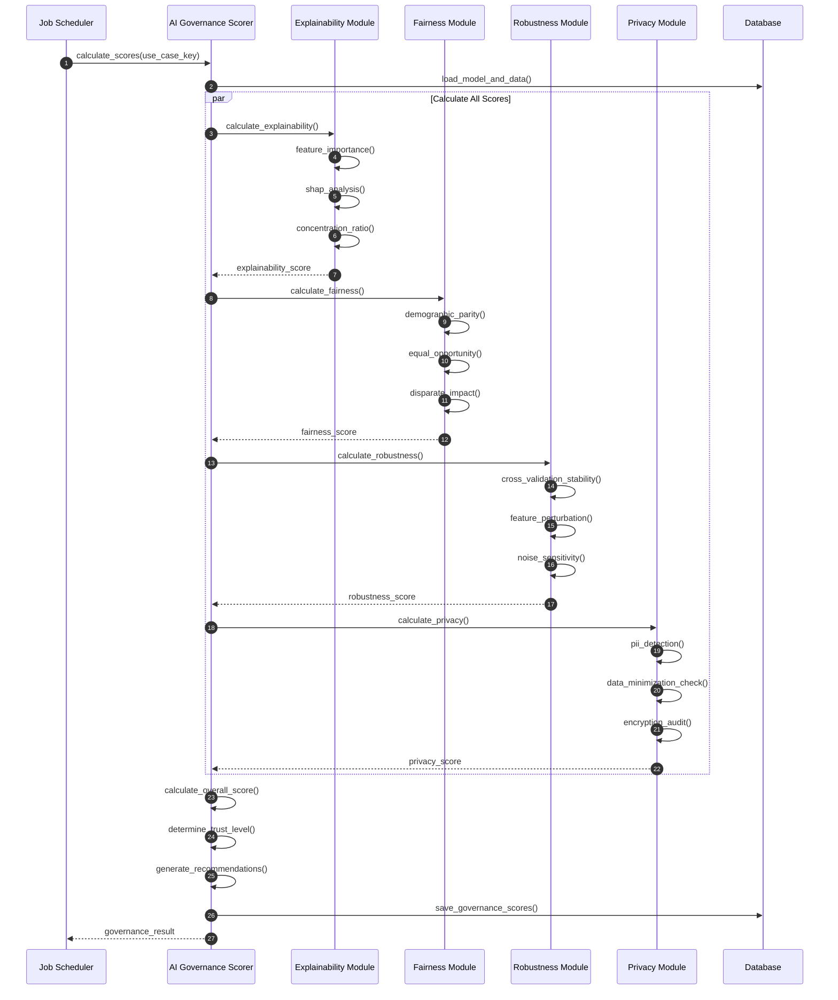

# Sequence Diagrams - Banking ML Pipeline

## 1. Manual Pipeline Execution

## 2. Model Training Pipeline

## 3. Real-time Inference

## 4. RAG Pipeline Query

## 5. Automated Pipeline Scheduling

## 6. AI Governance Scoring

