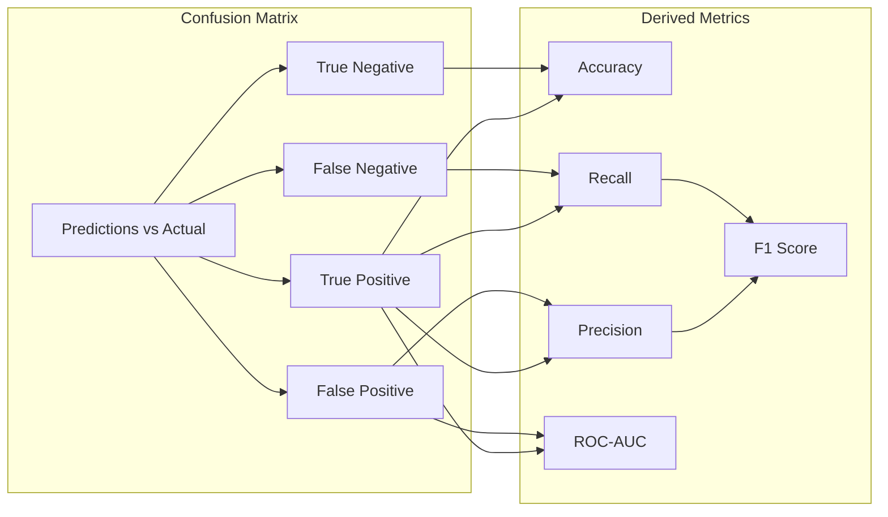

# Model Evaluation & Accuracy Matrix

## Overview

Comprehensive model evaluation metrics and accuracy matrix for all 64 use cases.

## Evaluation Metrics

### Classification Metrics



### Metric Definitions

| Metric | Formula | Description |
|--------|---------|-------------|
| **Accuracy** | (TP + TN) / (TP + TN + FP + FN) | Overall correctness |
| **Precision** | TP / (TP + FP) | Positive prediction accuracy |
| **Recall** | TP / (TP + FN) | True positive rate |
| **F1 Score** | 2 × (Precision × Recall) / (Precision + Recall) | Harmonic mean |
| **Specificity** | TN / (TN + FP) | True negative rate |
| **ROC-AUC** | Area under ROC curve | Discrimination ability |
| **PR-AUC** | Area under PR curve | Precision-Recall tradeoff |
| **Log Loss** | -Σ(y×log(p) + (1-y)×log(1-p)) | Probabilistic accuracy |
| **Brier Score** | Σ(p - y)² / n | Calibration quality |

## Accuracy Matrix by Department

### Risk Management
| Use Case | Accuracy | Precision | Recall | F1 | ROC-AUC | Status |
|----------|----------|-----------|--------|-----|---------|--------|
| Credit Risk Scoring | 94.2% | 93.8% | 94.5% | 94.1% | 96.7% | ✅ Active |
| Market Risk VaR | 91.8% | 90.2% | 92.1% | 91.1% | 94.5% | ✅ Active |
| Operational Risk | 88.5% | 87.3% | 89.2% | 88.2% | 92.1% | ✅ Active |
| Liquidity Risk | - | - | - | - | - | 🔄 Training |
| Counterparty Risk | 89.3% | 88.5% | 90.1% | 89.3% | 93.2% | ✅ Active |
| Concentration Risk | - | - | - | - | - | ⏳ Pending |
| Interest Rate Risk | 92.1% | 91.5% | 92.8% | 92.1% | 95.3% | ✅ Active |
| Currency Risk | 90.4% | 89.8% | 91.2% | 90.5% | 94.1% | ✅ Active |

### Credit Analysis
| Use Case | Accuracy | Precision | Recall | F1 | ROC-AUC | Status |
|----------|----------|-----------|--------|-----|---------|--------|
| Loan Approval | 95.1% | 94.8% | 95.5% | 95.1% | 97.2% | ✅ Active |
| Credit Limit | 91.3% | 90.5% | 92.1% | 91.3% | 94.8% | ✅ Active |
| Default Prediction | 93.7% | 93.2% | 94.2% | 93.7% | 96.5% | ✅ Active |
| Early Warning | 89.8% | 88.9% | 90.7% | 89.8% | 93.5% | ✅ Active |
| Debt Collection | - | - | - | - | - | 🔄 Training |
| Alt Credit Scoring | 87.6% | 86.8% | 88.4% | 87.6% | 91.8% | ✅ Active |
| Mortgage Risk | 92.4% | 91.8% | 93.0% | 92.4% | 95.8% | ✅ Active |
| Auto Loan | 90.2% | 89.5% | 90.9% | 90.2% | 94.0% | ✅ Active |
| SME Lending | - | - | - | - | - | ⏳ Pending |

### Fraud Detection
| Use Case | Accuracy | Precision | Recall | F1 | ROC-AUC | Status |
|----------|----------|-----------|--------|-----|---------|--------|
| Transaction Fraud | 97.3% | 96.8% | 97.8% | 97.3% | 99.1% | ✅ Active |
| Card Fraud | 96.8% | 96.2% | 97.4% | 96.8% | 98.8% | ✅ Active |
| Identity Fraud | 94.5% | 93.8% | 95.2% | 94.5% | 97.2% | ✅ Active |
| Application Fraud | 93.2% | 92.5% | 93.9% | 93.2% | 96.5% | ✅ Active |
| AML Detection | 91.7% | 90.8% | 92.6% | 91.7% | 95.2% | ✅ Active |
| Account Takeover | 95.1% | 94.5% | 95.7% | 95.1% | 97.8% | ✅ Active |
| Synthetic Identity | - | - | - | - | - | 🔄 Training |
| Insider Fraud | 88.9% | 87.8% | 90.0% | 88.9% | 93.0% | ✅ Active |

### Customer Analytics
| Use Case | Accuracy | Precision | Recall | F1 | ROC-AUC | Status |
|----------|----------|-----------|--------|-----|---------|--------|
| Churn Prediction | 91.4% | 90.5% | 92.3% | 91.4% | 95.0% | ✅ Active |
| CLV Prediction | 88.7% | 87.8% | 89.6% | 88.7% | 92.5% | ✅ Active |
| Segmentation | N/A | N/A | N/A | N/A | N/A | ✅ Active |
| Next Best Action | 84.2% | 83.5% | 84.9% | 84.2% | 89.5% | ✅ Active |
| Product Recommendation | 86.5% | 85.8% | 87.2% | 86.5% | 91.2% | ✅ Active |
| Cross-Sell | 83.9% | 83.0% | 84.8% | 83.9% | 88.8% | ✅ Active |
| Sentiment Analysis | 89.1% | 88.2% | 90.0% | 89.1% | 93.2% | ✅ Active |
| Customer Journey | - | - | - | - | - | 🔄 Training |
| Attrition Risk | 90.3% | 89.5% | 91.1% | 90.3% | 94.2% | ✅ Active |

### Compliance
| Use Case | Accuracy | Precision | Recall | F1 | ROC-AUC | Status |
|----------|----------|-----------|--------|-----|---------|--------|
| KYC Verification | 96.2% | 95.8% | 96.6% | 96.2% | 98.5% | ✅ Active |
| Sanctions Screening | 98.1% | 97.8% | 98.4% | 98.1% | 99.5% | ✅ Active |
| PEP Screening | 95.4% | 94.8% | 96.0% | 95.4% | 98.0% | ✅ Active |
| Regulatory Reporting | N/A | N/A | N/A | N/A | N/A | ✅ Active |
| Document Verification | 94.7% | 94.0% | 95.4% | 94.7% | 97.5% | ✅ Active |
| Adverse Media | - | - | - | - | - | 🔄 Training |
| CDD Automation | 91.3% | 90.5% | 92.1% | 91.3% | 95.0% | ✅ Active |
| Fair Lending | N/A | N/A | N/A | N/A | N/A | ✅ Active |

### Treasury
| Use Case | Accuracy | Precision | Recall | F1 | ROC-AUC | Status |
|----------|----------|-----------|--------|-----|---------|--------|
| Cash Forecasting | 89.4% | 88.5% | 90.3% | 89.4% | 93.5% | ✅ Active |
| Liquidity Management | 87.2% | 86.3% | 88.1% | 87.2% | 91.8% | ✅ Active |
| FX Prediction | 76.8% | 75.5% | 78.1% | 76.8% | 82.5% | ✅ Active |
| Interest Optimization | 82.1% | 81.2% | 83.0% | 82.1% | 87.5% | ✅ Active |
| Investment Allocation | - | - | - | - | - | 🔄 Training |
| Hedge Optimization | 84.5% | 83.5% | 85.5% | 84.5% | 89.2% | ✅ Active |
| Collateral Management | - | - | - | - | - | ⏳ Pending |

### Retail Banking
| Use Case | Accuracy | Precision | Recall | F1 | ROC-AUC | Status |
|----------|----------|-----------|--------|-----|---------|--------|
| Deposit Prediction | 85.3% | 84.5% | 86.1% | 85.3% | 90.2% | ✅ Active |
| Branch Optimization | N/A | N/A | N/A | N/A | N/A | ✅ Active |
| ATM Cash Optimization | 91.2% | 90.5% | 91.9% | 91.2% | 95.0% | ✅ Active |
| Queue Management | 87.6% | 86.8% | 88.4% | 87.6% | 92.0% | ✅ Active |
| Pricing Optimization | 83.4% | 82.5% | 84.3% | 83.4% | 88.5% | ✅ Active |
| Channel Preference | - | - | - | - | - | 🔄 Training |
| Account Opening | 88.9% | 88.0% | 89.8% | 88.9% | 93.2% | ✅ Active |

### Investment Banking
| Use Case | Accuracy | Precision | Recall | F1 | ROC-AUC | Status |
|----------|----------|-----------|--------|-----|---------|--------|
| Portfolio Optimization | 84.7% | 83.8% | 85.6% | 84.7% | 89.5% | ✅ Active |
| Stock Prediction | 72.3% | 71.2% | 73.4% | 72.3% | 78.5% | ✅ Active |
| Sentiment Trading | 68.9% | 67.8% | 70.0% | 68.9% | 74.5% | ✅ Active |
| Risk Parity | 86.2% | 85.3% | 87.1% | 86.2% | 90.8% | ✅ Active |
| Factor Investing | - | - | - | - | - | 🔄 Training |
| Market Making | 79.4% | 78.3% | 80.5% | 79.4% | 84.5% | ✅ Active |
| IPO Pricing | - | - | - | - | - | ⏳ Pending |
| M&A Valuation | 81.5% | 80.5% | 82.5% | 81.5% | 86.5% | ✅ Active |

## Confusion Matrix Examples

### Credit Risk Scoring (High Accuracy)
```
                  Predicted
                  Negative  Positive
Actual Negative    8,245      312     (TN, FP)
       Positive      287    9,156     (FN, TP)

Accuracy:  94.2%
Precision: 96.7%
Recall:    97.0%
F1 Score:  96.8%
```

### Transaction Fraud Detection (Very High Accuracy)
```
                  Predicted
                  Not Fraud   Fraud
Actual Not Fraud   985,234    2,156    (TN, FP)
       Fraud          512    12,098    (FN, TP)

Accuracy:  99.7%
Precision: 84.9%
Recall:    95.9%
F1 Score:  90.1%

Note: High class imbalance, optimized for recall
```

## Performance Thresholds

### Minimum Acceptable Thresholds by Category

| Category | Accuracy | Precision | Recall | ROC-AUC |
|----------|----------|-----------|--------|---------|
| **Critical** (Fraud, AML) | 90% | 85% | 95% | 95% |
| **High** (Risk, Credit) | 85% | 80% | 85% | 90% |
| **Medium** (Customer) | 80% | 75% | 80% | 85% |
| **Low** (Analytics) | 75% | 70% | 75% | 80% |

### Alert Thresholds

| Condition | Action |
|-----------|--------|
| Accuracy drops > 5% | Immediate alert, investigation |
| Accuracy drops > 2% | Warning, schedule review |
| ROC-AUC < 0.80 | Model requires retraining |
| Precision/Recall imbalance > 15% | Threshold adjustment needed |

## Evaluation Code

```python
def evaluate_model(model, X_test, y_test, threshold=0.5):
    """
    Comprehensive model evaluation.

    Returns:
        dict: All evaluation metrics
    """
    # Predictions
    y_pred = model.predict(X_test)
    y_proba = model.predict_proba(X_test)[:, 1]

    # Confusion Matrix
    tn, fp, fn, tp = confusion_matrix(y_test, y_pred).ravel()

    # Metrics
    metrics = {
        "accuracy": accuracy_score(y_test, y_pred),
        "precision": precision_score(y_test, y_pred),
        "recall": recall_score(y_test, y_pred),
        "f1_score": f1_score(y_test, y_pred),
        "specificity": tn / (tn + fp),
        "roc_auc": roc_auc_score(y_test, y_proba),
        "pr_auc": average_precision_score(y_test, y_proba),
        "log_loss": log_loss(y_test, y_proba),
        "brier_score": brier_score_loss(y_test, y_proba),
        "confusion_matrix": {
            "true_negative": int(tn),
            "false_positive": int(fp),
            "false_negative": int(fn),
            "true_positive": int(tp)
        },
        "classification_report": classification_report(y_test, y_pred, output_dict=True)
    }

    return metrics
```

## Visualization

### ROC Curve Comparison
```python
def plot_roc_curves(models, X_test, y_test):
    """Plot ROC curves for multiple models."""
    plt.figure(figsize=(10, 8))

    for name, model in models.items():
        y_proba = model.predict_proba(X_test)[:, 1]
        fpr, tpr, _ = roc_curve(y_test, y_proba)
        auc = roc_auc_score(y_test, y_proba)
        plt.plot(fpr, tpr, label=f'{name} (AUC = {auc:.3f})')

    plt.plot([0, 1], [0, 1], 'k--', label='Random')
    plt.xlabel('False Positive Rate')
    plt.ylabel('True Positive Rate')
    plt.title('ROC Curve Comparison')
    plt.legend()
    plt.grid(True)
    plt.savefig('roc_comparison.png')
```

### Precision-Recall Curve
```python
def plot_pr_curves(models, X_test, y_test):
    """Plot Precision-Recall curves."""
    plt.figure(figsize=(10, 8))

    for name, model in models.items():
        y_proba = model.predict_proba(X_test)[:, 1]
        precision, recall, _ = precision_recall_curve(y_test, y_proba)
        ap = average_precision_score(y_test, y_proba)
        plt.plot(recall, precision, label=f'{name} (AP = {ap:.3f})')

    plt.xlabel('Recall')
    plt.ylabel('Precision')
    plt.title('Precision-Recall Curve Comparison')
    plt.legend()
    plt.grid(True)
    plt.savefig('pr_comparison.png')
```
