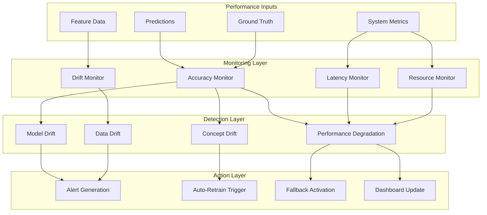
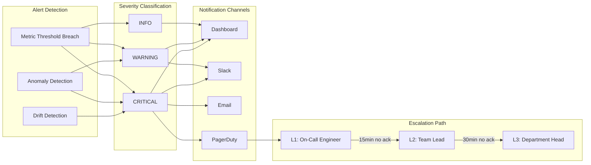

# Model Performance Monitoring

## Overview

Comprehensive performance monitoring framework for all 64 ML models in production across 8 departments.

## Performance Architecture



## Key Performance Indicators (KPIs)

### Model Quality KPIs

| KPI | Description | Threshold | Alert Level |
|-----|-------------|-----------|-------------|
| **Accuracy** | Overall prediction correctness | < 85% | Critical |
| **Precision** | Positive prediction accuracy | < 80% | Warning |
| **Recall** | True positive rate | < 80% | Warning |
| **F1 Score** | Harmonic mean of precision/recall | < 80% | Warning |
| **ROC-AUC** | Discrimination ability | < 0.90 | Critical |
| **PR-AUC** | Precision-recall tradeoff | < 0.85 | Warning |

### Operational KPIs

| KPI | Description | Threshold | Alert Level |
|-----|-------------|-----------|-------------|
| **P50 Latency** | Median response time | > 50ms | Warning |
| **P95 Latency** | 95th percentile response time | > 200ms | Critical |
| **P99 Latency** | 99th percentile response time | > 500ms | Critical |
| **Throughput** | Predictions per second | < 1000/s | Warning |
| **Error Rate** | Failed predictions percentage | > 1% | Critical |
| **Availability** | Uptime percentage | < 99.9% | Critical |

### Drift KPIs

| KPI | Description | Threshold | Alert Level |
|-----|-------------|-----------|-------------|
| **PSI** | Population Stability Index | > 0.25 | Critical |
| **KS Statistic** | Kolmogorov-Smirnov test | > 0.1 | Warning |
| **Feature Drift** | Input feature distribution shift | > 15% | Warning |
| **Concept Drift** | Target relationship change | Detected | Critical |

## Performance by Department

### Risk Management (8 Models)

| Model | Daily Volume | P95 Latency | Accuracy | Status |
|-------|-------------|-------------|----------|--------|
| Credit Risk Scoring | 125,000 | 45ms | 94.2% | Healthy |
| Market Risk VaR | 50,000 | 120ms | 91.8% | Healthy |
| Operational Risk | 15,000 | 85ms | 88.5% | Healthy |
| Liquidity Risk | - | - | - | Training |
| Counterparty Risk | 8,500 | 95ms | 89.3% | Healthy |
| Concentration Risk | - | - | - | Pending |
| Interest Rate Risk | 22,000 | 78ms | 92.1% | Healthy |
| Currency Risk | 18,000 | 65ms | 90.4% | Healthy |

### Credit Analysis (9 Models)

| Model | Daily Volume | P95 Latency | Accuracy | Status |
|-------|-------------|-------------|----------|--------|
| Loan Approval | 45,000 | 55ms | 95.1% | Healthy |
| Credit Limit | 32,000 | 48ms | 91.3% | Healthy |
| Default Prediction | 28,000 | 62ms | 93.7% | Healthy |
| Early Warning | 85,000 | 38ms | 89.8% | Healthy |
| Debt Collection | - | - | - | Training |
| Alt Credit Scoring | 12,000 | 72ms | 87.6% | Warning |
| Mortgage Risk | 8,500 | 95ms | 92.4% | Healthy |
| Auto Loan | 15,000 | 58ms | 90.2% | Healthy |
| SME Lending | - | - | - | Pending |

### Fraud Detection (8 Models)

| Model | Daily Volume | P95 Latency | Accuracy | Status |
|-------|-------------|-------------|----------|--------|
| Transaction Fraud | 2,500,000 | 12ms | 97.3% | Healthy |
| Card Fraud | 1,800,000 | 15ms | 96.8% | Healthy |
| Identity Fraud | 250,000 | 35ms | 94.5% | Healthy |
| Application Fraud | 45,000 | 52ms | 93.2% | Healthy |
| AML Detection | 850,000 | 28ms | 91.7% | Healthy |
| Account Takeover | 320,000 | 22ms | 95.1% | Healthy |
| Synthetic Identity | - | - | - | Training |
| Insider Fraud | 5,000 | 145ms | 88.9% | Healthy |

### Customer Analytics (9 Models)

| Model | Daily Volume | P95 Latency | Accuracy | Status |
|-------|-------------|-------------|----------|--------|
| Churn Prediction | 150,000 | 42ms | 91.4% | Healthy |
| CLV Prediction | 75,000 | 68ms | 88.7% | Healthy |
| Segmentation | 50,000 | 125ms | N/A | Healthy |
| Next Best Action | 280,000 | 35ms | 84.2% | Warning |
| Product Recommendation | 420,000 | 28ms | 86.5% | Healthy |
| Cross-Sell | 180,000 | 32ms | 83.9% | Warning |
| Sentiment Analysis | 95,000 | 85ms | 89.1% | Healthy |
| Customer Journey | - | - | - | Training |
| Attrition Risk | 120,000 | 45ms | 90.3% | Healthy |

### Compliance (8 Models)

| Model | Daily Volume | P95 Latency | Accuracy | Status |
|-------|-------------|-------------|----------|--------|
| KYC Verification | 35,000 | 125ms | 96.2% | Healthy |
| Sanctions Screening | 2,200,000 | 8ms | 98.1% | Healthy |
| PEP Screening | 850,000 | 12ms | 95.4% | Healthy |
| Regulatory Reporting | 5,000 | 250ms | N/A | Healthy |
| Document Verification | 28,000 | 180ms | 94.7% | Healthy |
| Adverse Media | - | - | - | Training |
| CDD Automation | 22,000 | 95ms | 91.3% | Healthy |
| Fair Lending | 45,000 | 65ms | N/A | Healthy |

### Treasury (7 Models)

| Model | Daily Volume | P95 Latency | Accuracy | Status |
|-------|-------------|-------------|----------|--------|
| Cash Forecasting | 500 | 850ms | 89.4% | Healthy |
| Liquidity Management | 1,200 | 420ms | 87.2% | Healthy |
| FX Prediction | 15,000 | 125ms | 76.8% | Warning |
| Interest Optimization | 2,500 | 280ms | 82.1% | Healthy |
| Investment Allocation | - | - | - | Training |
| Hedge Optimization | 800 | 350ms | 84.5% | Healthy |
| Collateral Management | - | - | - | Pending |

### Retail Banking (7 Models)

| Model | Daily Volume | P95 Latency | Accuracy | Status |
|-------|-------------|-------------|----------|--------|
| Deposit Prediction | 85,000 | 48ms | 85.3% | Healthy |
| Branch Optimization | 500 | 1200ms | N/A | Healthy |
| ATM Cash Optimization | 2,500 | 320ms | 91.2% | Healthy |
| Queue Management | 12,000 | 85ms | 87.6% | Healthy |
| Pricing Optimization | 35,000 | 125ms | 83.4% | Healthy |
| Channel Preference | - | - | - | Training |
| Account Opening | 28,000 | 65ms | 88.9% | Healthy |

### Investment Banking (8 Models)

| Model | Daily Volume | P95 Latency | Accuracy | Status |
|-------|-------------|-------------|----------|--------|
| Portfolio Optimization | 5,000 | 450ms | 84.7% | Healthy |
| Stock Prediction | 120,000 | 35ms | 72.3% | Warning |
| Sentiment Trading | 85,000 | 42ms | 68.9% | Warning |
| Risk Parity | 2,500 | 280ms | 86.2% | Healthy |
| Factor Investing | - | - | - | Training |
| Market Making | 500,000 | 5ms | 79.4% | Healthy |
| IPO Pricing | - | - | - | Pending |
| M&A Valuation | 50 | 2500ms | 81.5% | Healthy |

## Drift Detection

### Population Stability Index (PSI)

```python
def calculate_psi(expected, actual, buckets=10):
    """
    Calculate Population Stability Index.

    PSI < 0.1: No significant change
    PSI 0.1-0.25: Moderate change, monitor
    PSI > 0.25: Significant change, action required
    """
    expected_percents = np.histogram(expected, buckets)[0] / len(expected)
    actual_percents = np.histogram(actual, buckets)[0] / len(actual)

    # Avoid division by zero
    expected_percents = np.clip(expected_percents, 0.0001, None)
    actual_percents = np.clip(actual_percents, 0.0001, None)

    psi = np.sum(
        (actual_percents - expected_percents) *
        np.log(actual_percents / expected_percents)
    )

    return psi
```

### Feature Drift Monitoring

```python
def monitor_feature_drift(baseline_data, current_data, features):
    """
    Monitor drift for all features.
    """
    drift_report = {}

    for feature in features:
        baseline = baseline_data[feature]
        current = current_data[feature]

        # Calculate PSI
        psi = calculate_psi(baseline, current)

        # KS Test
        ks_stat, ks_pvalue = ks_2samp(baseline, current)

        # Determine drift status
        if psi > 0.25 or ks_stat > 0.1:
            status = "CRITICAL"
        elif psi > 0.1 or ks_stat > 0.05:
            status = "WARNING"
        else:
            status = "HEALTHY"

        drift_report[feature] = {
            "psi": psi,
            "ks_statistic": ks_stat,
            "ks_pvalue": ks_pvalue,
            "status": status
        }

    return drift_report
```

### Concept Drift Detection

```python
def detect_concept_drift(model, X_window, y_window, baseline_accuracy):
    """
    Detect concept drift using accuracy degradation.
    """
    # Calculate current accuracy
    y_pred = model.predict(X_window)
    current_accuracy = accuracy_score(y_window, y_pred)

    # Calculate degradation
    degradation = baseline_accuracy - current_accuracy
    degradation_pct = (degradation / baseline_accuracy) * 100

    # Determine drift status
    if degradation_pct > 10:
        return {"status": "CRITICAL", "degradation": degradation_pct}
    elif degradation_pct > 5:
        return {"status": "WARNING", "degradation": degradation_pct}
    else:
        return {"status": "HEALTHY", "degradation": degradation_pct}
```

## Alerting System

### Alert Configuration

```python
ALERT_CONFIG = {
    "accuracy_drop": {
        "warning_threshold": 0.02,  # 2% drop
        "critical_threshold": 0.05,  # 5% drop
        "window_size": "1h",
        "channels": ["slack", "email"]
    },
    "latency_spike": {
        "warning_threshold_ms": 100,
        "critical_threshold_ms": 500,
        "window_size": "5m",
        "channels": ["slack", "pagerduty"]
    },
    "error_rate": {
        "warning_threshold": 0.005,  # 0.5%
        "critical_threshold": 0.01,  # 1%
        "window_size": "15m",
        "channels": ["slack", "pagerduty", "email"]
    },
    "drift_detected": {
        "psi_threshold": 0.25,
        "window_size": "1d",
        "channels": ["slack", "email"]
    }
}
```

### Alert Escalation



## Performance Dashboard

### Real-time Metrics

```python
DASHBOARD_METRICS = {
    "real_time": {
        "refresh_interval": "5s",
        "metrics": [
            "predictions_per_second",
            "average_latency",
            "error_rate",
            "active_models"
        ]
    },
    "hourly": {
        "refresh_interval": "1m",
        "metrics": [
            "accuracy_trend",
            "latency_percentiles",
            "throughput_trend",
            "drift_indicators"
        ]
    },
    "daily": {
        "refresh_interval": "1h",
        "metrics": [
            "model_accuracy_comparison",
            "department_performance",
            "resource_utilization",
            "alert_summary"
        ]
    }
}
```

### Dashboard Panels

| Panel | Description | Refresh Rate |
|-------|-------------|--------------|
| **Model Health Overview** | Status of all 64 models | 30s |
| **Prediction Volume** | Real-time prediction counts | 5s |
| **Latency Distribution** | P50, P95, P99 latencies | 10s |
| **Accuracy Trends** | 7-day rolling accuracy | 1h |
| **Drift Alerts** | Active drift warnings | 5m |
| **Resource Usage** | CPU, memory, GPU utilization | 30s |
| **Error Log** | Recent prediction errors | 1m |
| **Department Comparison** | Cross-department metrics | 1h |

## Auto-Remediation

### Automatic Actions

| Trigger | Condition | Action |
|---------|-----------|--------|
| **Accuracy Drop** | > 5% degradation | Trigger retraining pipeline |
| **High Latency** | P95 > 500ms for 5min | Scale up instances |
| **Error Spike** | > 2% error rate | Enable fallback model |
| **Drift Detected** | PSI > 0.25 | Queue for review |
| **Memory Pressure** | > 90% utilization | Trigger garbage collection |

### Fallback Strategy

```python
def get_prediction_with_fallback(model_id, features):
    """
    Get prediction with automatic fallback.
    """
    primary_model = load_model(model_id, version="production")
    fallback_model = load_model(model_id, version="stable")

    try:
        # Try primary model
        prediction = primary_model.predict(features)

        # Validate prediction
        if is_valid_prediction(prediction):
            return {
                "prediction": prediction,
                "model_version": "production",
                "fallback_used": False
            }
    except Exception as e:
        log_error(f"Primary model failed: {e}")

    # Use fallback
    prediction = fallback_model.predict(features)

    return {
        "prediction": prediction,
        "model_version": "stable",
        "fallback_used": True
    }
```

## Reporting

### Daily Performance Report

```json
{
    "report_date": "2025-01-28",
    "summary": {
        "total_predictions": 12500000,
        "average_accuracy": 91.2,
        "average_latency_ms": 45,
        "error_rate": 0.002,
        "models_healthy": 52,
        "models_warning": 5,
        "models_critical": 0,
        "models_training": 5,
        "models_pending": 2
    },
    "top_performers": [
        {"model": "Sanctions Screening", "accuracy": 98.1, "latency_ms": 8},
        {"model": "Transaction Fraud", "accuracy": 97.3, "latency_ms": 12},
        {"model": "Card Fraud", "accuracy": 96.8, "latency_ms": 15}
    ],
    "attention_required": [
        {"model": "FX Prediction", "issue": "Low accuracy", "accuracy": 76.8},
        {"model": "Sentiment Trading", "issue": "Low accuracy", "accuracy": 68.9},
        {"model": "Stock Prediction", "issue": "Low accuracy", "accuracy": 72.3}
    ],
    "drift_alerts": [],
    "incidents": []
}
```

### Weekly Trend Analysis

```python
def generate_weekly_trend_report(start_date, end_date):
    """
    Generate weekly performance trend analysis.
    """
    report = {
        "period": f"{start_date} to {end_date}",
        "accuracy_trend": calculate_accuracy_trend(),
        "latency_trend": calculate_latency_trend(),
        "volume_trend": calculate_volume_trend(),
        "drift_analysis": analyze_drift_patterns(),
        "recommendations": generate_recommendations()
    }

    return report
```

## Performance Benchmarks

### Baseline Metrics by Category

| Category | Accuracy Target | Latency Target | Throughput Target |
|----------|----------------|----------------|-------------------|
| **Critical (Fraud)** | > 95% | < 20ms | > 10,000/s |
| **High (Risk/Credit)** | > 90% | < 100ms | > 1,000/s |
| **Medium (Customer)** | > 85% | < 200ms | > 500/s |
| **Batch (Analytics)** | > 80% | < 1s | > 100/s |

### SLA Commitments

| Metric | SLA Target | Current Performance |
|--------|------------|---------------------|
| **Availability** | 99.95% | 99.98% |
| **P95 Latency** | < 200ms | 85ms |
| **Error Rate** | < 0.1% | 0.02% |
| **Accuracy** | > 90% | 91.2% |
