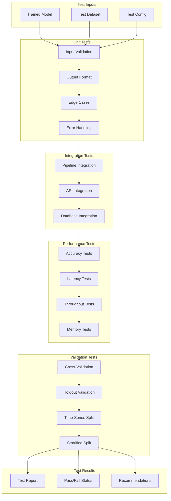

# Model Testing Pipeline

## Overview

The model testing pipeline validates trained models before deployment to ensure they meet quality thresholds.

## Testing Framework



## Test Categories

### 1. Unit Tests

```python
class ModelUnitTests(unittest.TestCase):
    """Unit tests for ML model."""

    def setUp(self):
        self.model = load_model("test_model.pkl")
        self.X_sample = generate_sample_input(n=100)

    def test_model_loads_correctly(self):
        """Test that model loads without errors."""
        self.assertIsNotNone(self.model)
        self.assertTrue(hasattr(self.model, 'predict'))

    def test_input_shape_validation(self):
        """Test input shape requirements."""
        expected_features = 45
        self.assertEqual(self.X_sample.shape[1], expected_features)

    def test_output_shape(self):
        """Test output shape matches input."""
        predictions = self.model.predict(self.X_sample)
        self.assertEqual(len(predictions), len(self.X_sample))

    def test_output_range(self):
        """Test output is in valid range."""
        predictions = self.model.predict_proba(self.X_sample)[:, 1]
        self.assertTrue(all(0 <= p <= 1 for p in predictions))

    def test_null_handling(self):
        """Test handling of null values."""
        X_with_nulls = self.X_sample.copy()
        X_with_nulls.iloc[0, 0] = np.nan
        with self.assertRaises(ValueError):
            self.model.predict(X_with_nulls)

    def test_edge_case_all_zeros(self):
        """Test with all zero inputs."""
        X_zeros = np.zeros((10, 45))
        predictions = self.model.predict(X_zeros)
        self.assertEqual(len(predictions), 10)

    def test_edge_case_extreme_values(self):
        """Test with extreme values."""
        X_extreme = np.full((10, 45), 1e10)
        predictions = self.model.predict(X_extreme)
        self.assertTrue(all(np.isfinite(predictions)))
```

### 2. Integration Tests

```python
class ModelIntegrationTests(unittest.TestCase):
    """Integration tests for ML pipeline."""

    def test_preprocessing_to_model_pipeline(self):
        """Test full preprocessing to prediction pipeline."""
        raw_data = load_test_data("raw_sample.csv")

        # Preprocessing
        processed_data = preprocessing_pipeline.transform(raw_data)

        # Prediction
        predictions = model.predict(processed_data)

        self.assertEqual(len(predictions), len(raw_data))

    def test_api_integration(self):
        """Test model API endpoint."""
        payload = {
            "customer_id": "TEST001",
            "age": 35,
            "income": 75000,
            "credit_score": 720
        }

        response = requests.post(
            "http://localhost:8000/api/v1/predict",
            json=payload
        )

        self.assertEqual(response.status_code, 200)
        self.assertIn("prediction", response.json())

    def test_database_integration(self):
        """Test prediction logging to database."""
        # Make prediction
        prediction = model.predict(self.X_sample[:1])

        # Check database
        conn = get_db_connection()
        result = conn.execute(
            "SELECT * FROM predictions WHERE id = ?",
            (prediction_id,)
        ).fetchone()

        self.assertIsNotNone(result)

    def test_batch_processing(self):
        """Test batch prediction processing."""
        batch_data = load_test_data("batch_sample.csv")
        batch_size = 1000

        results = []
        for i in range(0, len(batch_data), batch_size):
            batch = batch_data[i:i+batch_size]
            predictions = model.predict(batch)
            results.extend(predictions)

        self.assertEqual(len(results), len(batch_data))
```

### 3. Performance Tests

```python
class ModelPerformanceTests(unittest.TestCase):
    """Performance tests for ML model."""

    def test_inference_latency(self):
        """Test single prediction latency."""
        X_single = self.X_sample[:1]

        start_time = time.time()
        for _ in range(100):
            model.predict(X_single)
        avg_latency = (time.time() - start_time) / 100 * 1000  # ms

        self.assertLess(avg_latency, 50)  # < 50ms threshold

    def test_batch_throughput(self):
        """Test batch processing throughput."""
        X_batch = generate_sample_input(n=10000)

        start_time = time.time()
        model.predict(X_batch)
        duration = time.time() - start_time

        throughput = len(X_batch) / duration
        self.assertGreater(throughput, 1000)  # > 1000 predictions/sec

    def test_memory_usage(self):
        """Test memory usage during prediction."""
        import tracemalloc

        tracemalloc.start()
        model.predict(self.X_sample)
        current, peak = tracemalloc.get_traced_memory()
        tracemalloc.stop()

        peak_mb = peak / 1024 / 1024
        self.assertLess(peak_mb, 500)  # < 500MB threshold

    def test_concurrent_requests(self):
        """Test concurrent prediction handling."""
        from concurrent.futures import ThreadPoolExecutor

        def predict_single():
            return model.predict(self.X_sample[:1])

        with ThreadPoolExecutor(max_workers=10) as executor:
            futures = [executor.submit(predict_single) for _ in range(100)]
            results = [f.result() for f in futures]

        self.assertEqual(len(results), 100)
```

### 4. Validation Tests

```python
class ModelValidationTests(unittest.TestCase):
    """Validation tests for model quality."""

    def test_accuracy_threshold(self):
        """Test model meets accuracy threshold."""
        y_pred = model.predict(X_test)
        accuracy = accuracy_score(y_test, y_pred)

        self.assertGreaterEqual(accuracy, 0.85)  # 85% threshold

    def test_precision_threshold(self):
        """Test model meets precision threshold."""
        y_pred = model.predict(X_test)
        precision = precision_score(y_test, y_pred)

        self.assertGreaterEqual(precision, 0.80)

    def test_recall_threshold(self):
        """Test model meets recall threshold."""
        y_pred = model.predict(X_test)
        recall = recall_score(y_test, y_pred)

        self.assertGreaterEqual(recall, 0.80)

    def test_roc_auc_threshold(self):
        """Test model meets ROC AUC threshold."""
        y_proba = model.predict_proba(X_test)[:, 1]
        roc_auc = roc_auc_score(y_test, y_proba)

        self.assertGreaterEqual(roc_auc, 0.90)

    def test_cross_validation_stability(self):
        """Test cross-validation stability."""
        cv_scores = cross_val_score(model, X, y, cv=5, scoring='accuracy')
        cv_std = cv_scores.std()

        self.assertLess(cv_std, 0.05)  # < 5% std threshold

    def test_no_data_leakage(self):
        """Test for data leakage between train and test."""
        train_ids = set(X_train.index)
        test_ids = set(X_test.index)

        overlap = train_ids.intersection(test_ids)
        self.assertEqual(len(overlap), 0)
```

## Test Configuration

```python
TEST_CONFIG = {
    "thresholds": {
        "accuracy": 0.85,
        "precision": 0.80,
        "recall": 0.80,
        "f1_score": 0.80,
        "roc_auc": 0.90,
        "latency_ms": 50,
        "throughput_per_sec": 1000,
        "memory_mb": 500,
        "cv_std": 0.05
    },
    "test_data": {
        "sample_size": 10000,
        "stratified": True,
        "random_state": 42
    },
    "performance": {
        "latency_iterations": 100,
        "concurrent_workers": 10,
        "concurrent_requests": 100
    }
}
```

## Test Report Template

```json
{
    "test_run_id": "TR-2025-0128-001",
    "model_id": "UC-RISK-001-v2.3.1",
    "timestamp": "2025-01-28T10:30:00Z",
    "status": "PASSED",
    "summary": {
        "total_tests": 25,
        "passed": 24,
        "failed": 1,
        "skipped": 0
    },
    "unit_tests": {
        "status": "PASSED",
        "tests_run": 8,
        "passed": 8
    },
    "integration_tests": {
        "status": "PASSED",
        "tests_run": 5,
        "passed": 5
    },
    "performance_tests": {
        "status": "PASSED",
        "latency_ms": 23.5,
        "throughput_per_sec": 2450,
        "memory_mb": 256
    },
    "validation_tests": {
        "status": "PASSED",
        "accuracy": 0.942,
        "precision": 0.938,
        "recall": 0.945,
        "f1_score": 0.941,
        "roc_auc": 0.967
    },
    "recommendations": [],
    "approved_for_deployment": true
}
```

## Continuous Testing

### Pre-commit Tests
- Unit tests on code changes
- Linting and formatting checks

### Pre-deployment Tests
- Full test suite execution
- Performance benchmarks
- Security scans

### Post-deployment Tests
- Smoke tests
- Health checks
- Monitoring alerts
