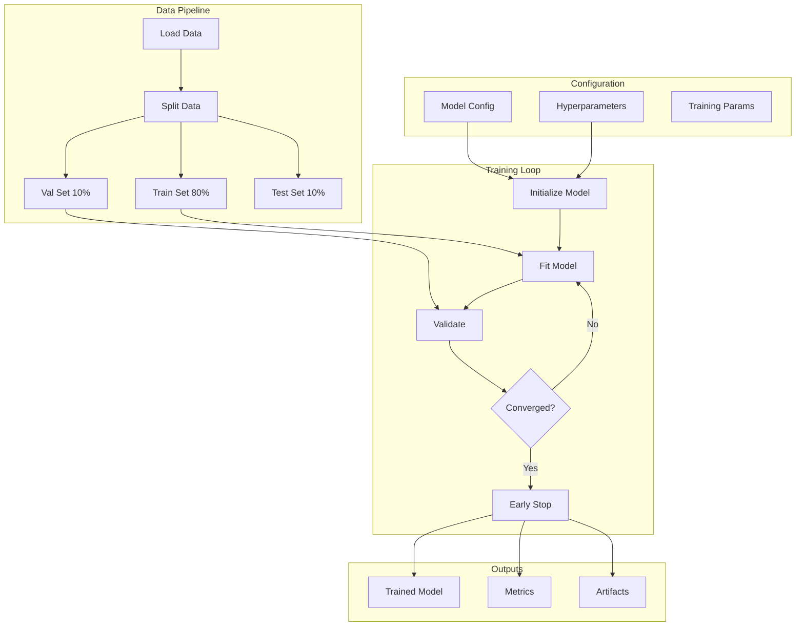

# Model Training Pipeline

## Overview

The model training pipeline handles end-to-end training of ML models for all 64 use cases across 8 departments.

## Training Architecture



## Supported Algorithms

### Classification Models
| Algorithm | Use Cases | Hyperparameters |
|-----------|-----------|-----------------|
| XGBoost | Credit Risk, Fraud | n_estimators, max_depth, learning_rate |
| Random Forest | Default Prediction | n_estimators, max_depth, min_samples |
| Logistic Regression | Binary Classification | C, penalty, solver |
| LightGBM | Large Datasets | num_leaves, learning_rate |
| Neural Network | Complex Patterns | layers, neurons, dropout |

### Regression Models
| Algorithm | Use Cases | Hyperparameters |
|-----------|-----------|-----------------|
| XGBoost Regressor | CLV, Risk Scoring | n_estimators, max_depth |
| Random Forest Regressor | Price Prediction | n_estimators, max_features |
| Linear Regression | Simple Trends | fit_intercept, normalize |
| Gradient Boosting | Time Series | n_estimators, learning_rate |

### Clustering Models
| Algorithm | Use Cases | Hyperparameters |
|-----------|-----------|-----------------|
| K-Means | Customer Segmentation | n_clusters, init, max_iter |
| DBSCAN | Anomaly Detection | eps, min_samples |
| Hierarchical | Grouping | n_clusters, linkage |

## Training Configuration

```python
TRAINING_CONFIG = {
    "data_split": {
        "train_ratio": 0.8,
        "val_ratio": 0.1,
        "test_ratio": 0.1,
        "stratify": True,
        "random_state": 42
    },
    "cross_validation": {
        "n_folds": 5,
        "shuffle": True,
        "scoring": ["accuracy", "f1", "roc_auc"]
    },
    "early_stopping": {
        "patience": 10,
        "min_delta": 0.001,
        "restore_best_weights": True
    },
    "hyperparameter_tuning": {
        "method": "grid_search",  # or "random_search", "bayesian"
        "cv": 3,
        "n_iter": 50
    }
}
```

## Training Process

### Step 1: Data Preparation
```python
def prepare_training_data(use_case_key: str) -> Tuple[np.ndarray, ...]:
    """
    Load and prepare data for training.

    Returns:
        X_train, X_val, X_test, y_train, y_val, y_test
    """
    # Load processed data
    data = load_processed_data(use_case_key)

    # Split features and target
    X = data.drop(columns=[TARGET_COLUMN])
    y = data[TARGET_COLUMN]

    # Train/Val/Test split
    X_train, X_temp, y_train, y_temp = train_test_split(
        X, y, test_size=0.2, stratify=y, random_state=42
    )
    X_val, X_test, y_val, y_test = train_test_split(
        X_temp, y_temp, test_size=0.5, stratify=y_temp, random_state=42
    )

    return X_train, X_val, X_test, y_train, y_val, y_test
```

### Step 2: Model Training
```python
def train_model(
    X_train: np.ndarray,
    y_train: np.ndarray,
    X_val: np.ndarray,
    y_val: np.ndarray,
    config: dict
) -> BaseEstimator:
    """
    Train model with cross-validation and hyperparameter tuning.
    """
    # Initialize model
    model = XGBClassifier(**config['model_params'])

    # Hyperparameter tuning
    param_grid = config['param_grid']
    grid_search = GridSearchCV(
        model,
        param_grid,
        cv=5,
        scoring='roc_auc',
        n_jobs=-1,
        verbose=1
    )

    # Fit with early stopping
    grid_search.fit(
        X_train, y_train,
        eval_set=[(X_val, y_val)],
        early_stopping_rounds=10,
        verbose=False
    )

    return grid_search.best_estimator_
```

### Step 3: Cross-Validation
```python
def cross_validate_model(
    model: BaseEstimator,
    X: np.ndarray,
    y: np.ndarray,
    n_folds: int = 5
) -> dict:
    """
    Perform k-fold cross-validation.
    """
    cv_results = cross_validate(
        model, X, y,
        cv=StratifiedKFold(n_splits=n_folds, shuffle=True, random_state=42),
        scoring=['accuracy', 'precision', 'recall', 'f1', 'roc_auc'],
        return_train_score=True,
        n_jobs=-1
    )

    return {
        'accuracy': cv_results['test_accuracy'].mean(),
        'precision': cv_results['test_precision'].mean(),
        'recall': cv_results['test_recall'].mean(),
        'f1': cv_results['test_f1'].mean(),
        'roc_auc': cv_results['test_roc_auc'].mean(),
        'cv_std': cv_results['test_accuracy'].std()
    }
```

## Hyperparameter Tuning

### Grid Search
```python
PARAM_GRIDS = {
    'xgboost': {
        'n_estimators': [100, 200, 500],
        'max_depth': [3, 5, 7, 10],
        'learning_rate': [0.01, 0.05, 0.1],
        'min_child_weight': [1, 3, 5],
        'subsample': [0.8, 0.9, 1.0],
        'colsample_bytree': [0.8, 0.9, 1.0]
    },
    'random_forest': {
        'n_estimators': [100, 200, 500],
        'max_depth': [None, 10, 20, 30],
        'min_samples_split': [2, 5, 10],
        'min_samples_leaf': [1, 2, 4]
    },
    'logistic_regression': {
        'C': [0.001, 0.01, 0.1, 1, 10],
        'penalty': ['l1', 'l2'],
        'solver': ['liblinear', 'saga']
    }
}
```

### Bayesian Optimization
```python
def bayesian_optimization(model, X, y, param_space, n_iter=50):
    """
    Hyperparameter tuning using Bayesian optimization.
    """
    opt = BayesSearchCV(
        model,
        param_space,
        n_iter=n_iter,
        cv=5,
        scoring='roc_auc',
        n_jobs=-1,
        random_state=42
    )
    opt.fit(X, y)
    return opt.best_params_, opt.best_score_
```

## Model Artifacts

### Saved Artifacts
| Artifact | Format | Description |
|----------|--------|-------------|
| Model | .pkl / .joblib | Serialized model object |
| Metadata | .json | Model configuration and parameters |
| Metrics | .json | Training and validation metrics |
| Feature Names | .json | List of feature names |
| Scaler | .pkl | Fitted preprocessing scaler |
| Encoder | .pkl | Fitted categorical encoder |

### Model Registry Entry
```json
{
    "model_id": "UC-RISK-001-v2.3.1",
    "use_case_key": "credit_risk_scoring",
    "algorithm": "XGBClassifier",
    "version": "2.3.1",
    "created_at": "2025-01-28T10:00:00Z",
    "created_by": "training_pipeline",
    "metrics": {
        "accuracy": 0.942,
        "precision": 0.938,
        "recall": 0.945,
        "f1_score": 0.941,
        "roc_auc": 0.967
    },
    "hyperparameters": {
        "n_estimators": 200,
        "max_depth": 7,
        "learning_rate": 0.05
    },
    "feature_count": 45,
    "training_samples": 500000,
    "file_path": "models/credit_risk_scoring/v2.3.1/model.pkl",
    "status": "production"
}
```

## Training Monitoring

### Metrics Tracked
- Training loss per epoch
- Validation loss per epoch
- Learning rate schedule
- GPU/CPU utilization
- Memory usage
- Training duration

### Experiment Tracking
```python
def log_experiment(model, metrics, params, artifacts):
    """
    Log training experiment for reproducibility.
    """
    experiment = {
        "timestamp": datetime.now().isoformat(),
        "model_type": type(model).__name__,
        "parameters": params,
        "metrics": metrics,
        "artifacts": artifacts,
        "environment": {
            "python_version": sys.version,
            "sklearn_version": sklearn.__version__,
            "numpy_version": np.__version__
        }
    }
    save_experiment_log(experiment)
```
